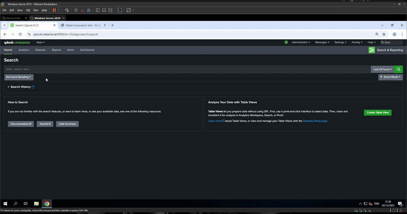
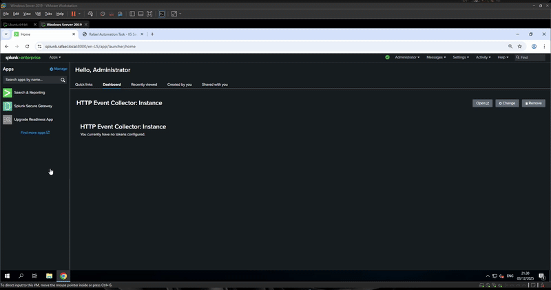
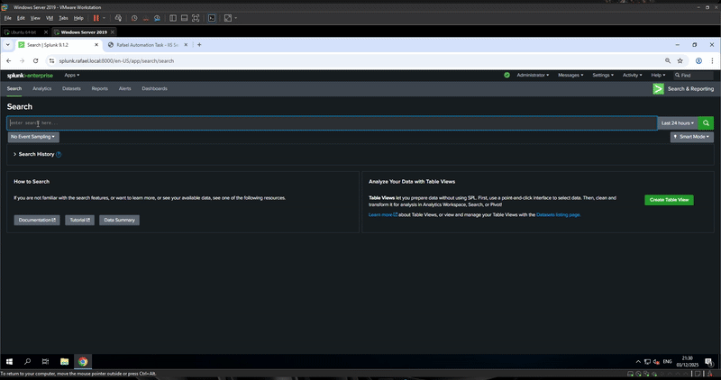
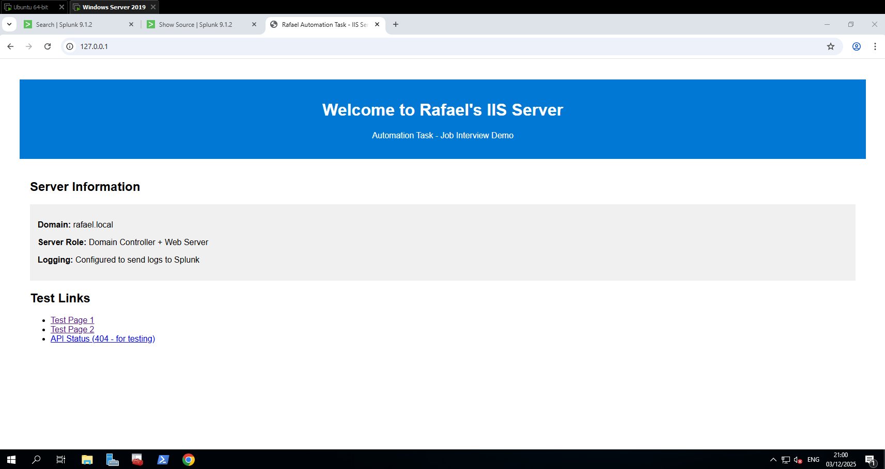
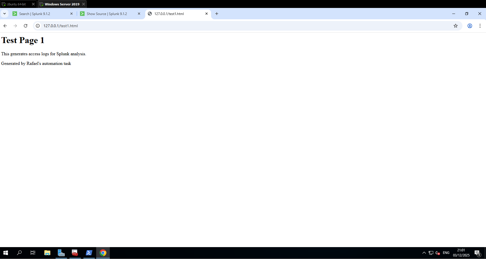
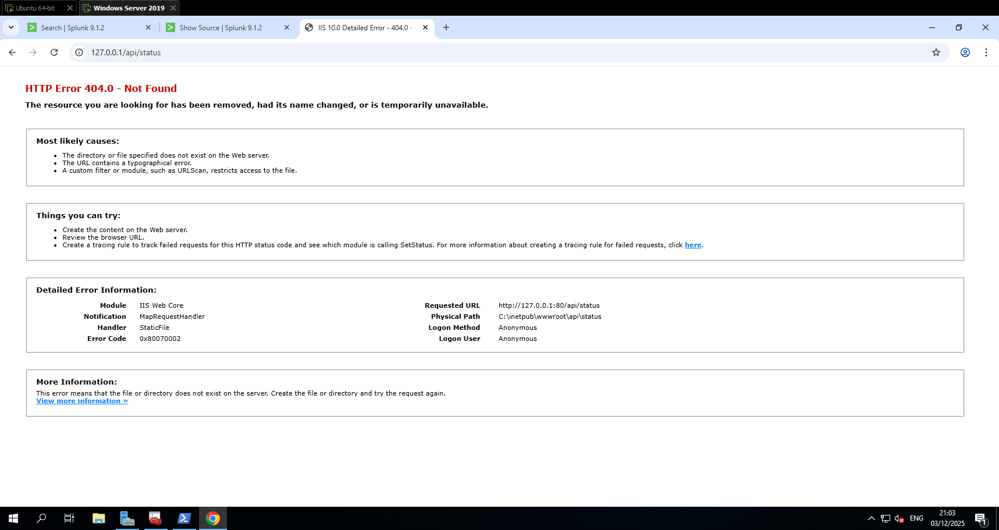

# Windows Server Infrastructure Automation

Automated deployment of Windows Server infrastructure with centralized logging using Ansible.

## Architecture Overview

```
┌─────────────────────────────────────────┐
│ Linux VM - 192.168.74.130               │
│ ┌─────────────────────────────────────┐ │
│ │ Splunk Enterprise (Docker)          │ │
│ │ - Web UI: :8000 (HTTPS)             │ │
│ │ - Management: :8089                 │ │
│ │ - Log Receiver: :9997               │ │
│ └─────────────────────────────────────┘ │
└─────────────────────────────────────────┘
                    ▲
                    │ Encrypted Log Forwarding
                    │ via Splunk Universal Forwarder
                    │
┌─────────────────────────────────────────┐
│ Windows Server - 192.168.74.129         │
│ ┌─────────────────────────────────────┐ │
│ │ Active Directory Domain Services    │ │
│ │ - Domain: rafael.local              │ │
│ │ - NetBIOS: RAFAELDOM                │ │
│ │ - Computer: RAFAELDC                │ │
│ └─────────────────────────────────────┘ │
│ ┌─────────────────────────────────────┐ │
│ │ Certificate Authority               │ │
│ │ - Enterprise CA (with AD fallback)  │ │
│ │ - SSL Certificate Management        │ │
│ └─────────────────────────────────────┘ │
│ ┌─────────────────────────────────────┐ │
│ │ IIS Web Server                      │ │
│ │ - HTTP: :80 / HTTPS: :443           │ │
│ │ - W3C Extended Logging              │ │
│ │ - SSL/TLS Enabled                   │ │
│ └─────────────────────────────────────┘ │
└─────────────────────────────────────────┘
```

## Core Components

### Windows Server (192.168.74.129)
- **Active Directory**: Domain controller (rafael.local)
- **Certificate Authority**: Enterprise CA with Standalone fallback
- **IIS Web Server**: W3C logging enabled
- **Splunk Universal Forwarder**: Log shipping

### Linux Server (192.168.74.130)
- **Splunk Enterprise**: Docker-based log analysis
- **SSL Integration**: Uses Windows CA certificates

## Quick Start

### Prerequisites
- Ubuntu 24.04+ with Ansible 2.9+
- Windows Server 2019+ with WinRM enabled
- Network: 192.168.74.0/24
- Resources: 4GB RAM, 40GB disk per VM

### Initial Setup

1. **Configure WinRM on Windows Server** (run as Administrator):
```powershell
Enable-PSRemoting -Force
Set-Item WSMan:\localhost\Client\TrustedHosts -Value "192.168.74.130" -Force
Set-Item WSMan:\localhost\Service\Auth\Basic -Value $true
New-NetFirewallRule -DisplayName "WinRM HTTP" -Direction Inbound -LocalPort 5985 -Protocol TCP -Action Allow
Restart-Service WinRM
```

2. **Install Required Collections**:
```bash
ansible-galaxy collection install microsoft.ad ansible.windows community.docker community.crypto
```

### Deployment Options

#### Option 1: Automated Installation (Recommended)
```bash
chmod +x install.sh
./install.sh
```

#### Option 2: Manual Step-by-Step Deployment
```bash
cd ansible

# Core infrastructure setup
ansible-playbook 01.setup_active_directory/playbook.yml
ansible-playbook 02.setup_certificate_authority/playbook.yml
ansible-playbook 03.setup_iis/playbook.yml

# Security and certificates
ansible-playbook 04.generate_certificates/playbook.yml
ansible-playbook 05.configure_splunk_ssl/playbook.yml

# Logging and monitoring
ansible-playbook 06.setup_log_forwarding/playbook.yml
ansible-playbook 07.finalize_setup/playbook.yml
```

**Deployment Time**: ~45 minutes (varies by hardware)

## Access Points

| Service | URL | Credentials | Purpose |
|---------|-----|-------------|---------|
| **IIS Web Server** | http://192.168.74.129<br/>https://192.168.74.129 | Windows Admin | Web services with SSL |
| **Splunk Enterprise** | https://192.168.74.130:8000 | admin / SplunkAdmin123! | Log analysis and monitoring |
| **Windows Server** | RDP: 192.168.74.129:3389 | Administrator / 123qweA | Server management |
| **Active Directory** | rafael.local domain | Administrator / 123qweA | Domain services |

## Deployment Workflow

| Step | Playbook | Purpose | Key Features |
|------|----------|---------|--------------|
| **1** | `01.setup_active_directory/` | Domain Controller Setup | Computer rename, AD DS installation, forest creation |
| **2** | `02.setup_certificate_authority/` | Certificate Authority | Enterprise CA with Standalone fallback |
| **3** | `03.setup_iis/` | Web Server Configuration | IIS installation, W3C logging, test content |
| **4** | `04.generate_certificates/` | SSL Certificate Creation | CA-signed certificates for secure communications |
| **5** | `05.configure_splunk_ssl/` | Splunk SSL Setup | Certificate integration, Docker deployment |
| **6** | `06.setup_log_forwarding/` | Log Forwarding | Universal Forwarder, IIS log shipping |
| **7** | `07.finalize_setup/` | System Validation | Health checks, service verification |

### Project Structure
```
├── ansible/                        # Ansible automation
│   ├── 01.setup_active_directory/  # AD domain controller
│   ├── 02.setup_certificate_authority/ # Enterprise/Standalone CA
│   ├── 03.setup_iis/               # IIS web server + logging
│   ├── 04.generate_certificates/   # SSL certificate management
│   ├── 05.configure_splunk_ssl/    # Splunk SSL configuration
│   ├── 06.setup_log_forwarding/    # Log shipping setup
│   ├── 07.finalize_setup/          # Validation and health checks
│   ├── ansible.cfg                 # Ansible configuration
│   ├── inventory.ini               # Target hosts definition
│   └── requirements.yml            # Required Ansible collections
├── install.sh                      # Automated deployment script
└── README.md                       # This documentation
```

## Features

- Idempotent playbooks (safe to run multiple times)
- Enterprise CA with Standalone fallback
- End-to-end SSL/TLS certificate management
- IIS logs forwarded to Splunk
- Automated health checks
- Error handling with retry mechanisms

## Configuration

### Network
- Subnet: 192.168.74.0/24
- Windows Server: 192.168.74.129
- Linux Server: 192.168.74.130
- Ports: 80/443, 5985 (WinRM), 8000/8089/9997 (Splunk)

### Ansible Collections
- `microsoft.ad` (≥1.0.0)
- `ansible.windows` (≥2.0.0)
- `community.docker` (≥3.0.0)
- `community.crypto` (≥2.0.0)

## Requirements
- VM Resources: 4GB RAM, 2 CPU cores per VM
- Disk Space: 40GB+ Windows, 20GB+ Linux
- Network: Gigabit recommended

## Media
# Agents Query



# Valid HTTPS Certificate inside the browser



# IP Query


# IIS Website







